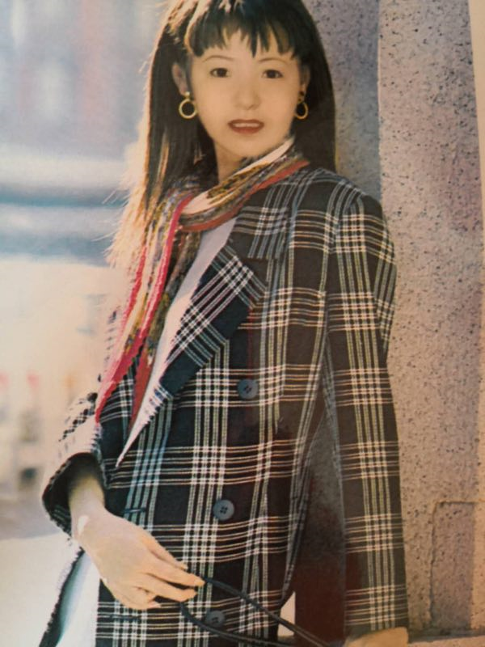

# 5.12 陆梦楠（二）

在我的记忆中，见到妈妈这件事，是我最最开心幸福的事情。打记事开始，我与妈妈相处的时光便少的可怜，一年三次缩减到一年两次，到了中学，变成了一年一次。我永远不会忘记想要见到她的那种渴望，这种渴望不亚于任何描述火热爱情的矫情字眼。妈妈在我心里，是那么完美，漂亮、智慧、善良、贤惠。。。她就是我心目中女人该有的样子，上得厅堂，下得厨房。 妈妈对我是溺爱的，也许是对我有愧疚，鲜少限制我花钱的欲望，尽力满足我的要求。到现在为止，她没有打骂过我，从不让我干家务，尽量不让我的手碰到脏水，从家居用品到服装鞋帽，都尽力给我最好。但当我在外求学打拼的时候，她又粗糙对待，从小就告诉我，吃到虫子不要尖叫，挑出来继续吃，如果吃到半只虫，就当补蛋白质了；当我身处较为恶劣的环境矫情时，她会淡淡的说一句：别人能待你有什么不能的；大学的时候，当我表达羡慕别的同学有家长可以依赖少付出努力时，她认真的跟我说，打你出生就给你算过命，你这一生靠不上父母、靠不上朋友、靠不上老公，一切只能靠自己（这件事从来没有去考证过，但我深信不疑）；当我抱怨工作量大，工资却不高时，她淡定的说：这很合理，你做着价值三万的工作量，给你一万工资，当你拿到两万工资时，你需要完成价值五万的工作量。。。  
  
妈妈对我是严厉的，对我设置了很多边界限制，比如：至今对于染发烫发、穿着、饰品等都有着严格的限制，在家里，从来不准穿吊带衫、不穿短裙、不染头发，不戴超过三种饰品；不能在街上对陌生人品头论足，不去看热闹，不能说脏话，不能饮酒开车；不对她撒谎，任何时候都要坦诚，我有义务让她知道我的动态（这义务等同于她养育我的义务）；不能未经同意带男朋友来见她，尽量不要叫同事朋友到我的住所等等。她尽力让我成为一个端庄、优雅的人，三岁起诗词歌赋、琴棋书画、女红织物一样不差得培养着，很可惜我生得性格活泼外向，少了些许恬静淡雅，端庄就更谈不上了。  
  
妈妈是我永远的精神支柱。我是个情绪不稳定的人，她了解我的愤怒、悲伤、欢乐和自傲，所以，在任何失落的时候，她都给予我最有效的安慰，在任何我极乐的时候，她都会给我当头一棒，让我收起翘起的尾巴。朋友背叛我踩踏我时，她说我要以德报怨，让他们知道我是值得真心交往的朋友，失去我是他们的损失，而我学会总结和分析，逐渐地在人际关系中从四处碰壁成长为圆滑相处，明白君子之交淡如水的深意；研究课题遇阻时，她让我回家睡觉，请假出去玩儿，给我钱吃好吃的，然后让我重新再来；失恋难过时，她扔给我一句：你享受过多少快乐，现在就要经受多少痛苦，一切都是公平的。然后，一整个星期都没有联络我，直到我平复心情主动打给她，后来我才知道，这一个星期中她辗转反侧，为我担忧心疼。遇到难题，她永远能给我方向和指导，像是我人生的导师，她在50岁之前，都不停地学习，和事业有成的人接触汲取信息，为的是与时俱进，才能保持对我正确的引导。我在她的庇护下，一直觉得自己是个天真快乐的孩子，世间的一切好与坏都不那么可怕，因为有人保护我，直到我30岁。  
  
回国后，我无法再无忧无虑做个有隐私且独立的青年，中国社会过分的“关心”让我焦虑，无所适从，而妈妈也在经历同样的改变。退休经商到50多岁，决定回到家里安度晚年，成为小区里大爷大妈中的一员。最可怕的是，她每天都沉浸在这样的“关心”之中，这带给她巨大的压力。她把一切顶了下来，给予我最大的空间和足够的尊重，卸下我的忧愁担在自己身上。最近回家，发现她变矮了，越来越像孩子了，在我工作和生活的诸多讨论中，她逐渐地透露出担心和不安。我意识到，妈妈老了，我不能再让她继续为我顶着天，是时候换我来成为她的保护伞，我想要给她最深沉的爱护，让她成为最漂亮可爱的女生。

今天是母亲节，在今天结束的最后五分钟里，让我们大声的说出对母亲的爱吧：“妈妈我永远爱您！  
  

